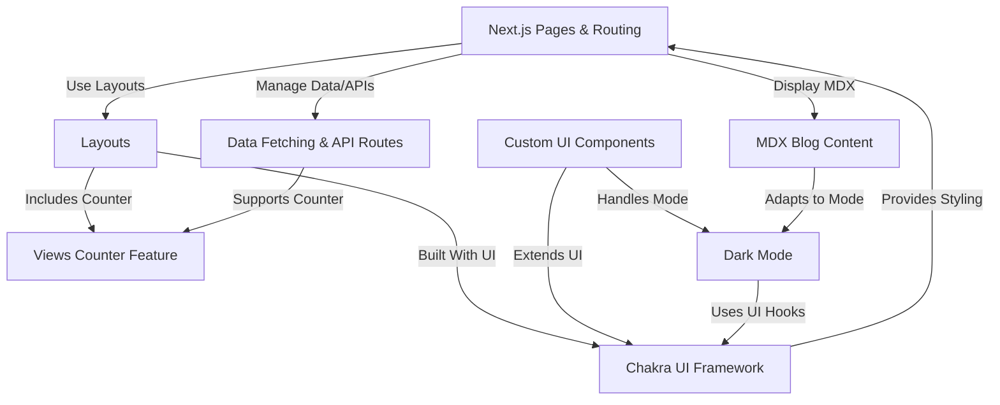

# Tutorial: portfolio-next-blog

This project is a personal **website** serving as a *portfolio* and *blog*.
It's built using the **Next.js** framework, which handles different web
pages and navigation. Blog posts are written in **MDX**, a special
format mixing text and interactive elements. The site's look and feel
are powered by the **Chakra UI** library, enhanced with *custom components*,
and includes features like a *dark mode* and a blog post *views counter*.
It also fetches data for displaying content and interacting with a simple
backend for the views counter.

## Visual Overview

